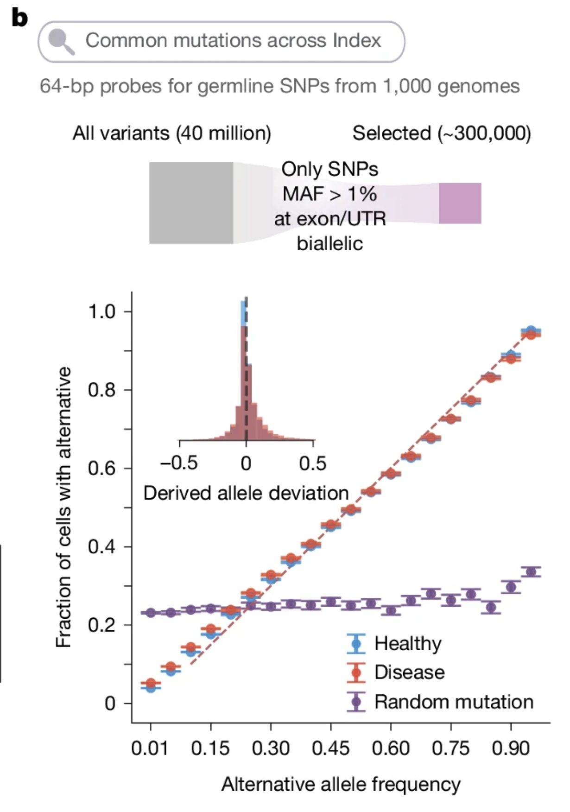
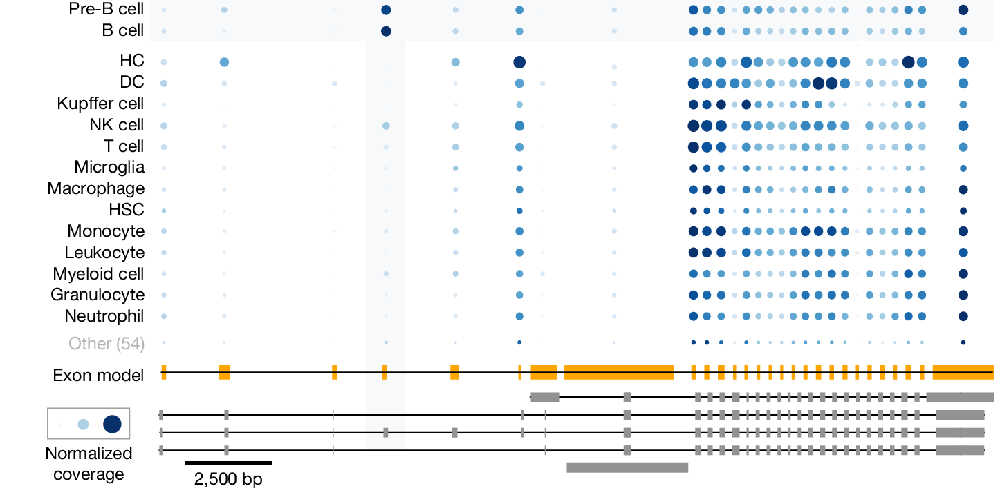
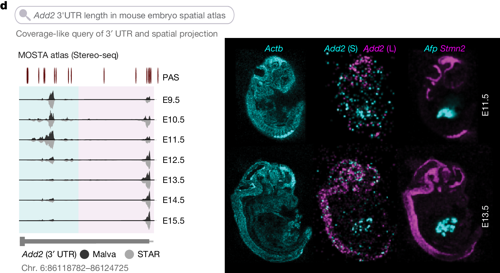
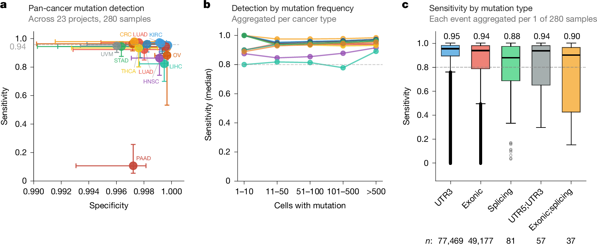
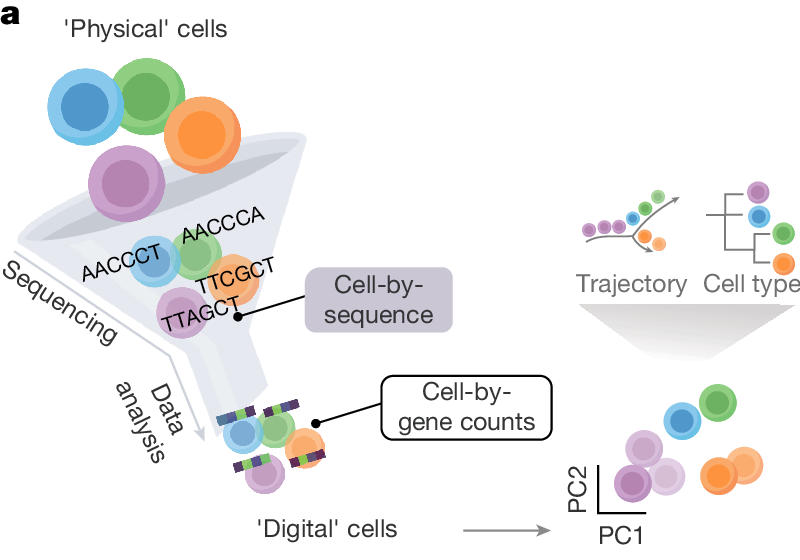
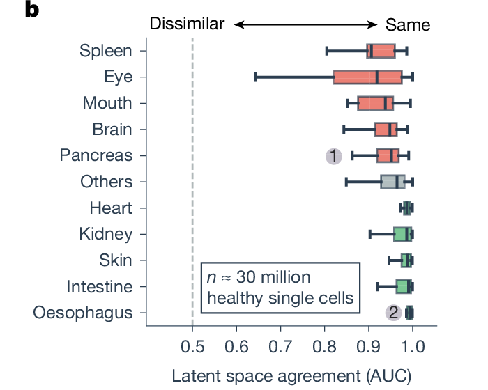
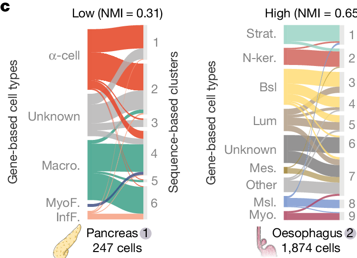
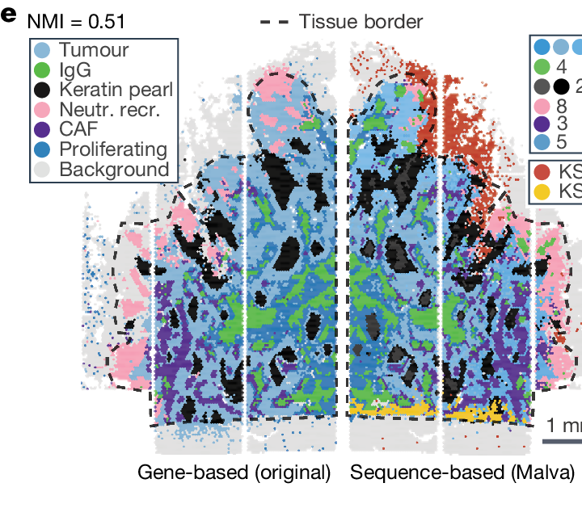
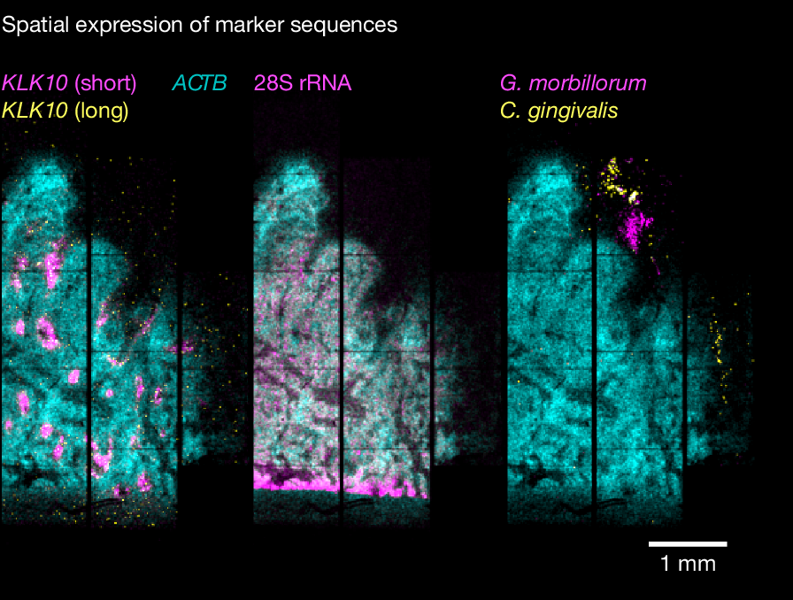

## The question: Which cells contain this sequence?

::: {.sequence-demo}
**Example: *DNMT3A* R882H (27 bases)**

CGTCTCCAACATGAGCC**G**CTTGGCGAG (usual)

CGTCTCCAACATGAGCC**A**CTTGGCGAG (mutated)

**G → A** mutation *DNMT3A* c.2645G>A
:::

- **Clonal haematopoiesis:** blood cells descended from one mutated stem cell

::: {.question .small}
Which blood cells contain this changed sequence in their RNA?
:::

What could this search tell us?

- Which blood-cell types show the mutation?
- Do cells with the mutation form a distinct group?
- Where are other changed gene sequences found?

Conventional way: single-cell DNA seq.

::: {.source}
Sequence context: [Berenstein et al. 2015](https://pmc.ncbi.nlm.nih.gov/articles/PMC4443651/) · R882H variant: [ClinVar](https://www.ncbi.nlm.nih.gov/clinvar/variation/375881/) · Clonal haematopoiesis: [Nam et al. 2023](https://pmc.ncbi.nlm.nih.gov/articles/PMC10068894/)
:::

## What is lost in a gene-count matrix (Xiaochen part)?

:::: {.flow}
::: {.flowbox}
**Sequencing reads**

[ACGT… · cell barcode]{.flow-subtitle}
:::
::: {.arrow}
→
:::
::: {.flowbox}
**Reference mapping**

[assign reads to genes]{.flow-subtitle}
:::
::: {.arrow}
→
:::
::: {.flowbox}
**Cell × gene counts**

[many sequences, one gene total]{.flow-subtitle}
:::
::::

- Gene counts: a useful summary of expression
- Sequence differences: often absent from the summary
- Malva: query the underlying RNA sequence evidence

::: {.source}
Paper, Introduction and Fig. 1
:::

## Glossary 1 · k-mers and probes

::: {.sequence-demo}
**Read:** `ACGTTACGAT`

**4-mers:** `ACGT` `CGTT` `GTTA` `TTAC` `TACG` `ACGA` `CGAT`
:::

- **k-mer:** a sequence of *k* nucleotides
- **Probe:** sequence submitted for search
- **Index:** stored links between k-mers and their cells

::: {.slide-aside}
Illustration: overlapping 4-mers · Malva index: sampled 24-mers by default · probe search: sliding windows
:::

::: {.source}
Paper, Methods: Malva Index architecture; sequence querying
:::

## Glossary 2 · interpretation

- **Reference / alternative allele:** two sequence forms at a variant site
- **Splice junction:** sequence joining two exons
- **Isoform:** one transcript form of a gene
- **Pseudocount:** Malva's k-mer match total; not a UMI count
- **Bucket:** group of related k-mers used as one cell feature

::: {.source}
Paper, Figs. 3–5 and Discussion
:::

## Malva in one diagram

:::: {.flow}
::: {.flowbox}
**Public FASTQ files**

[reads + cell barcodes]{.flow-subtitle}
:::
::: {.arrow}
→
:::
::: {.flowbox}
**Malva Index**

[k-mer → cells]{.flow-subtitle}
:::
::: {.arrow}
←
:::
::: {.flowbox}
**Sequence query**

[variant · junction · gene]{.flow-subtitle}
:::
::::
::: {.resultbox}
Matched cells + sample and cell metadata
:::

- Index each dataset; merge indices as data arrive
- Search across datasets without remapping reads

::: {.source}
Paper, Fig. 1 and Methods
:::

## What is new here?

- Sequence search at **single-cell resolution** across a large public index
- Index design for low-memory queries and incremental updates
- Cell-by-sequence analysis beyond targeted searches

::: {.slide-aside}
Combined contribution: scalable retrieval · linked cell metadata · sequence-derived cell features
:::

::: {.source}
Paper, Introduction, Figs. 1–2 and Fig. 5
:::

## How to read a positive result

:::: {.columns .threecol}
::: {.column width="32%"}
**Probe**

What sequence was searched?
:::
::: {.column width="32%"}
**Observability**

Was that locus sampled?
:::
::: {.column width="32%"}
**Context**

Which cell, donor, tissue and assay?
:::
::::

- A hit: evidence for the queried RNA sequence
- No hit: may reflect limited expression or coverage
- Compare positive cells with a suitable denominator

::: {.source}
Paper, Results and Limitations
:::

## 1 · Germline variation

::: {.question .small}
Can atlas RNA data recover known population variants?
:::

- 296,985 common, coding, biallelic SNPs
- 64-nucleotide allele-specific probes
- Healthy and disease samples; altered-sequence controls

::: {.source}
Paper, Fig. 3b and “Screening for germline variation”
:::

## Germline screening · result and boundary
::::: {.columns .figure-split .germline}
:::: {.column width="42%"}
::: {.paper-figure}
{fig-alt="Observed alternative allele frequencies in healthy and disease samples track population frequencies; altered-sequence controls do not." width="100%"}
:::
::::
:::: {.column .figure-notes width="58%"}
[Observed allele frequencies tracked population expectations in healthy and disease samples.]{.takeaway}

The altered-sequence controls stayed near the background rate.

::: {.boundary-note}
A positive allele probe gives RNA sequence evidence. It does not resolve the donor genotype without coverage and allele-expression checks.
:::
::::
:::::

::: {.source}
León-Periñán et al., *Nature* 2026, Fig. 3b
:::
## 2 · Isoform usage

:::: {.flow .compact}
::: {.flowbox}
**Same gene**

[similar total counts]{.flow-subtitle}
:::
::: {.arrow}
≠
:::
::: {.flowbox}
**Same transcript**

[different exons or 3′ ends]{.flow-subtitle}
:::
::::

- Probe a distinguishing exon, junction or 3′ UTR segment
- Compare signal across cell types or spatial regions
- Check assay coverage before interpretation

::: {.source}
Paper, Fig. 3c–d
:::

## Example · *Ptprc* exon A
::::: {.columns .figure-split .wide-figure}
:::: {.column width="70%"}
::: {.paper-figure}
{fig-alt="Coverage-like query across the Ptprc locus in Tabula Muris cell types." width="100%"}
:::
::::
:::: {.column .figure-notes width="30%"}
[B cells show stronger inclusion of exon A than the other immune populations.]{.takeaway}

Gene totals conceal this exon-level contrast.

::: {.boundary-note}
Coverage supports exon usage. Full-length isoform assignment needs evidence across the transcript.
:::
::::
:::::

::: {.source}
León-Periñán et al., *Nature* 2026, Fig. 3c
:::
## Example · *Add2* 3′ UTR
::::: {.columns .figure-split .add2}
:::: {.column width="70%"}
::: {.paper-figure}
{fig-alt="Add2 3-prime UTR coverage through mouse development and spatial maps of short and long forms." width="100%"}
:::
::::
:::: {.column .figure-notes width="30%"}
[The distal 3′ UTR signal localises to developing neural tissue; the proximal form accumulates in liver.]{.takeaway}

Spatial context explains the apparent developmental shift in bulk profiles.
::::
:::::

::: {.source}
León-Periñán et al., *Nature* 2026, Fig. 3d
:::
## 3 · Cancer somatic mutations

::: {.question .small}
Can known tumour mutations be found in single-cell RNA?
:::

- Allele-specific probes for expressed SNVs
- Comparison with scTML mutation calls
- 280 tumour samples across 16 cancer types

::: {.source}
Paper, Fig. 4 and “Querying cancer somatic mutations at scale”
:::

## Somatic mutations · what was shown
::: {.paper-figure .full-width}
{fig-alt="Pan-cancer mutation detection specificity and sensitivity, detection by mutation frequency, and sensitivity by mutation type." width="100%"}
:::

::: {.result-line}
**Across cancer types:** high specificity and mean sensitivity around 0.94. Splice-proximal variants were harder to recover.
:::

::: {.boundary-note .compact-note}
This benchmark tests retrieval of supplied mutations. Clone inference needs multiple informative loci and independent checks.
:::

::: {.source}
León-Periñán et al., *Nature* 2026, Fig. 4a–c
:::
## 4 · From sequence search to cell comparison
::::: {.columns .figure-split .representation}
:::: {.column width="53%"}
::: {.paper-figure}
{fig-alt="Sequenced cells represented as either cell-by-gene counts or cell-by-sequence features before dimensionality reduction." width="100%"}
:::
::::
:::: {.column .figure-notes width="47%"}
[The same reads can support a gene-count representation or a sequence-derived representation.]{.takeaway}

Malva groups related k-mers into buckets, then builds an embedding for neighbours and clusters.
::::
:::::

::: {.source}
León-Periñán et al., *Nature* 2026, Fig. 5a; Methods: bucketing approach
:::
## Cell clustering from sequence composition
::::: {.columns .figure-grid .clustering}
:::: {.column width="44%"}
::: {.paper-figure}
{fig-alt="Agreement between gene-count and sequence-based latent spaces across human tissues." width="100%"}

[Agreement varies by tissue and assay]{.figure-caption}
:::
::::
:::: {.column width="56%"}
::: {.paper-figure}
{fig-alt="Examples of low and high concordance between gene-based cell types and sequence-based clusters." width="100%"}

[Low and high clustering concordance]{.figure-caption}
:::
::::
:::::

::: {.boundary-note .compact-note}
Shared structure recovers familiar populations. Divergent clusters need biological evidence before interpretation.
:::

::: {.source}
León-Periñán et al., *Nature* 2026, Fig. 5b–c and Extended Data Fig. 10
:::
## From a cluster to a marker sequence
::::: {.columns .figure-grid .markers}
:::: {.column width="50%"}
::: {.paper-figure}
{fig-alt="Gene-based and sequence-based spatial clusters in a head and neck tumour section." width="100%"}

[Sequence-derived clusters preserve tissue structure]{.figure-caption}
:::
::::
:::: {.column width="50%"}
::: {.paper-figure .dark-panel}
{fig-alt="Spatial expression of assembled marker sequences including short KLK10 and bacterial ribosomal RNA signals." width="100%"}

[Assembled markers localise within and outside the tissue]{.figure-caption}
:::
::::
:::::

::: {.result-line}
*KLK10* short-form signal localised within tumour regions; bacterial rRNA markers appeared outside the tissue.
:::

::: {.source}
León-Periñán et al., *Nature* 2026, Fig. 5e,h
:::
## What can we do with the tool?

- **Targeted search:** a sequence → matching cells and samples
- **Coverage:** signal along a transcript or region
- **Cell representation:** buckets → clustering and markers

::: {.slide-aside}
Next: three demonstrations · verified inputs · saved outputs
:::

::: {.source}
[Malva client](https://github.com/malva-bio/malva_client) · [cellxmer documentation](https://malva.readthedocs.io/en/latest/cmd_cellxmer.html)
:::

## Demonstration 1 · sequence search

- Warm-up: search **CD3D** and inspect returned cell types
- *DNMT3A* R882H: paired 47-base reference and mutant probes
- Compare RNA-positive cells within a selected sample
- Record query, index version, filters and denominator

::: {.demo-note}
Pending: Malva account access · live query · saved result
:::

::: {.source}
[Client quick start](https://github.com/malva-bio/malva_client)
:::

## Demonstration 2 · transcript usage

- Select a verified *Ptprc* exon A probe
- Compare B cells with other immune cells
- Display coverage beside gene-level signal
- Check capture protocol and probe specificity

::: {.demo-note}
Pending: tested probe · selected sample · saved result
:::

::: {.source}
Paper, Fig. 3c · [Malva client](https://github.com/malva-bio/malva_client)
:::

## Demonstration 3 · cell-by-bucket analysis

- Choose a small, publicly available dataset
- Build cell-by-bucket matrix with `cellxmer`
- Compare gene and bucket clustering
- Inspect one candidate marker sequence

::: {.demo-note}
Pending: precomputed index · clusters · marker assembly
:::

::: {.source}
Paper, Fig. 5 · [cellxmer documentation](https://malva.readthedocs.io/en/latest/cmd_cellxmer.html)
:::

## Three possible research uses

:::: {.columns .threecol}
::: {.column width="32%"}
**Data integration**

Sequence features alongside gene counts; improvement on a defined task
:::
::: {.column width="32%"}
**Lineage tracing**

Mutation panel; combined evidence across loci and cells
:::
::: {.column width="32%"}
**HCA survey**

Clonal haematopoiesis variants in suitable public samples
:::
::::

::: {.source}
Discussion proposals; not applications validated in this paper
:::

## What must be checked?

- Locus coverage, transcript expression and 3′ capture bias
- Sequencing errors, probe specificity and related sequences
- Donor, study, assay and cell-type effects
- Independent evidence for genotype or clone assignment
- Privacy implications of donor-linked variants

::: {.source}
Paper, Limitations and Supplementary Discussion
:::

## Discussion

- Which sequence questions are difficult with our current data?
- Where would a sequence layer add information to gene counts?
- What evidence would make a mutation-defined clone convincing?
- Is an HCA clonal haematopoiesis survey feasible with RNA coverage?

::: {.source}
León-Periñán et al., *Nature* 2026
:::

## References {.appendix}

- León-Periñán D, Karaiskos N, Rajewsky N. *Ultrafast and reference-free sequence discovery in single-cell data*. Nature. 2026. <https://doi.org/10.1038/s41586-026-10975-w>
- [Malva client and examples](https://github.com/malva-bio/malva_client)
- [Malva local tools documentation](https://malva.readthedocs.io/en/latest/)
